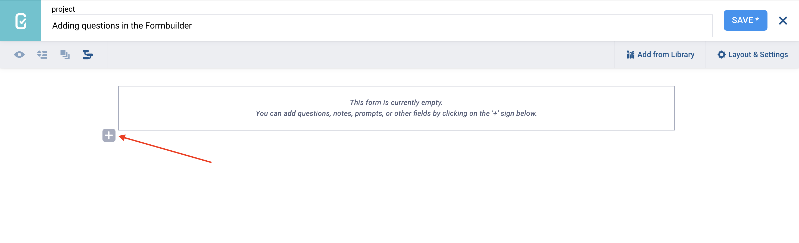
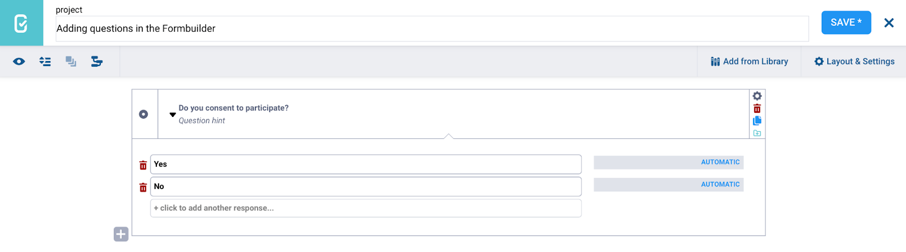

El **Constructor de Formularios** es la herramienta visual más rápida para comenzar a diseñar encuestas en **DataUMSA**. Funciona directamente desde el navegador de internet, sin necesidad de instalar software adicional en tu computadora.

---

## Paso 1: Crear un Nuevo Proyecto

1. Inicia sesión en tu cuenta en la [Plataforma DataUMSA](https://app.data.umsa.bo).
2. En la pantalla principal del panel de control, haz clic en el botón **NUEVO**.
3. Selecciona la opción **Construir desde cero**.
4. Completa la ficha básica del proyecto:
   - **Título del proyecto:** (ej. *Diagnóstico de Recursos Hídricos Cuenca Choqueyapu*).
   - **Descripción:** Breve resumen de los objetivos de la investigación.
   - **Sector y País:** Selecciona la disciplina académica y Bolivia.
5. Haz clic en **Crear proyecto**.

Inmediatamente accederás al lienzo de edición interactivo de tu cuestionario.

---

## Paso 2: Añadir Preguntas

Dentro del constructor verás un botón destacado con el signo más (**+**) para agregar preguntas:

1. Haz clic en el botón para añadir pregunta.
2. Escribe el texto de tu pregunta (por ejemplo: *"¿Cuál es la principal fuente de agua en su comunidad?"*).
3. Haz clic en **Añadir pregunta**.
4. Se desplegará el catálogo de tipos de preguntas disponibles.

### Catálogo de Preguntas Disponibles

* **Texto:** Para nombres, apellidos, descripciones u opiniones abiertas.
* **Seleccionar Uno (Select One):** El encuestado solo puede escoger una única opción de la lista (ej. Género, Nivel de Instrucción).
* **Seleccionar Muchos (Select Many):** Permite marcar múltiples alternativas simultáneas (ej. *"¿Qué cultivos produce en su parcela?"*).
* **Número Entero / Decimal:** Ideal para edades, ingresos, hectáreas o mediciones numéricas. Impide el ingreso accidental de letras o caracteres inválidos.
* **Fecha y Hora:** Despliega un selector de calendario y reloj con validación de formato.
* **Punto GPS (Geopoint):** Captura las coordenadas geográficas de latitud, longitud y altitud mediante el receptor satelital del teléfono móvil.
* **Fotografía / Audio / Video:** Solicita al encuestador tomar una fotografía de evidencia (ej. estado de infraestructura) o grabar una nota de voz.
* **Código de Barras / QR:** Escanea códigos impresos en credenciales o inventarios.
* **Firma Digital:** Permite que el informante firme directamente sobre la pantalla táctil para registrar su consentimiento informado.

Para eliminar una opción de respuesta si te equivocas, haz clic en el ícono de papelera situado al lado de la opción:

---

## Paso 3: Configurar Restricciones y Ayuda

Al pasar el cursor sobre cualquier pregunta creada, aparecerá un ícono de **engranaje** (Configuración). Al hacer clic en él, podrás personalizar las propiedades de la variable:

* **Respuesta obligatoria:** Marca esta opción para impedir que el encuestador envíe la boleta si la pregunta queda vacía. Es fundamental para variables críticas de identificación o consentimiento.
* **Pista de ayuda (Hint):** Agrega un texto de instrucción secundaria bajo la pregunta (ej. *"Indique la cantidad en hectáreas; use punto para decimales"*).
* **Criterio de validación:** Permite definir rangos aceptables para evitar valores atípicos absurdos (por ejemplo, exigir que la edad sea mayor o igual a 18 y menor a 110 años).

---

## Paso 4: Lógica de Salto (Condicionales)

La **Lógica de Salto** (*Skip Logic*) permite que ciertas preguntas solo se muestren a informantes que cumplan con criterios específicos, manteniendo la encuesta concisa y relevante.

Por ejemplo, la pregunta *"¿Cuántos meses tiene de gestación?"* solo debe formularse si en la pregunta de género se seleccionó *"Femenino"*.

Para configurar una lógica condicional:
1. Abre la configuración (el engranaje) de la pregunta dependiente que deseas condicionar.
2. Ve a la pestaña **Lógica de Salto** en el panel izquierdo.
3. Haz clic en **Añadir una condición**.
4. Define la regla lógica:
   - Selecciona la pregunta detonante (ej. *Género*).
   - Establece la condición (ej. *Es igual a* $\rightarrow$ *Femenino*).

> [!IMPORTANT]
> La lógica de salto evalúa las respuestas en tiempo real durante la entrevista, ocultando automáticamente los bloques que no apliquen al perfil del encuestado.

---

## Paso 5: Guardar e Implementar (Publicar)

1. Haz clic en el botón **Guardar** (esquina superior derecha) de manera regular mientras realizas cambios.
2. Cierra el editor del formulario y regresa a la vista general del proyecto.
3. Haz clic en el botón verde **Implementar**.

> [!NOTE]
> **¿Qué significa implementar?** Al implementar, el sistema compila la estructura de tu cuestionario y genera las versiones optimizadas para la web y para la sincronización con **DataUMSA Collect**. Cada vez que realices modificaciones posteriores, deberás presionar **Re-implementar** para que los cambios se reflejen en los dispositivos móviles de los encuestadores.
