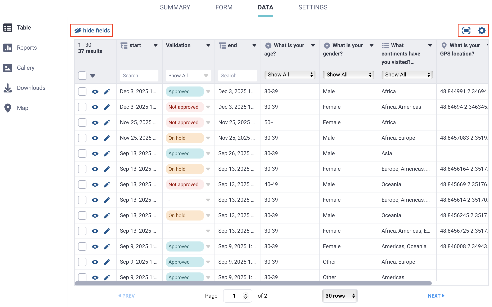
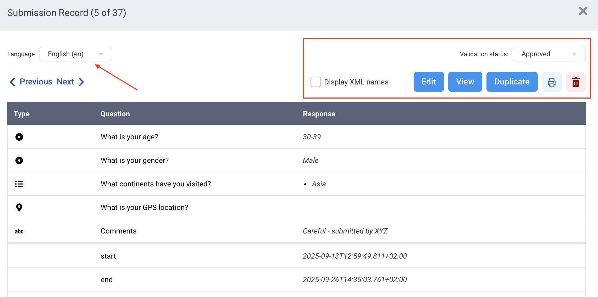
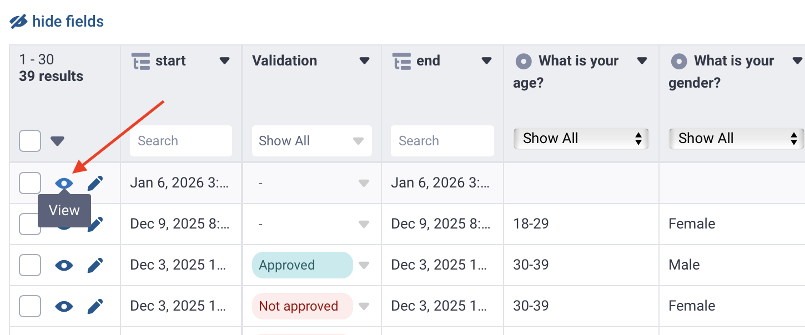
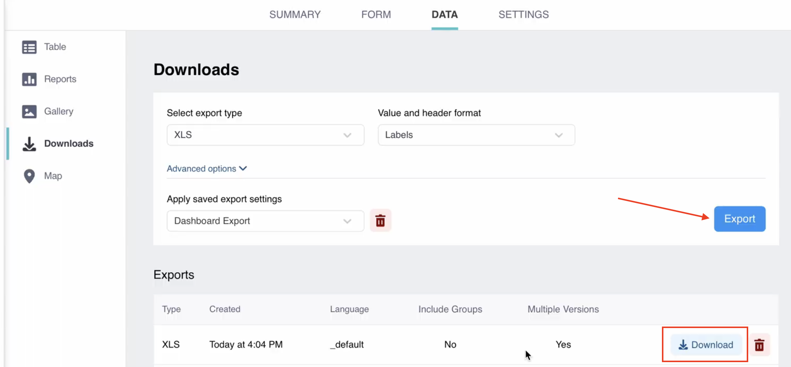

A medida que las personas responden tus enlaces web, o tus encuestadores envían su trabajo desde la aplicación móvil **DataUMSA Collect**, los datos comenzarán a llegar en tiempo real a la plataforma **DataUMSA**.

Para ver estos resultados, simplemente entra a tu proyecto y haz clic en la pestaña superior llamada **Datos**.

---

## Ver los Datos en Formato de Tabla

Dentro de la pestaña **Datos**, haz clic en **Tabla** en el submenú de la izquierda. Aquí verás todas las respuestas recolectadas organizadas en una cuadrícula estructurada similar a una hoja de cálculo interactiva.

* **Cada fila** representa una encuesta completada (una persona entrevistada o registro capturado).
* **Cada columna** representa una variable o pregunta de tu formulario.

### Buscar y Filtrar Respuestas
Si recolectaste cientos o miles de encuestas y buscas registros específicos, puedes usar la barra de búsqueda o el icono de **filtro** que se encuentra sobre la tabla para filtrar rápidamente (por ejemplo, registros por encuestador, rango de fechas o departamento).

---

## Editar y Validar Datos en Campo

Durante el trabajo de campo, pueden ocurrir errores tipográficos o respuestas que requieren aclaración. Como administrador o coordinador del proyecto, dispones de herramientas de auditoría directa:

1. **Edición rápida:** En la tabla, haz doble clic sobre la celda que contiene el error y escribe el valor corregido.
2. **Vista detallada:** Haz clic en el icono del **Ojo** (Ver) o del **Lápiz** (Editar) al inicio de la fila para examinar todas las respuestas de esa persona en formato de lista.

### Validar las Encuestas (Control de Calidad)
DataUMSA te permite llevar un estricto control de calidad del levantamiento. Junto a cada respuesta hay un indicador de estado. Al hacer clic en él, puedes actualizar la encuesta a:
* **Aprobado** (Verde): Has revisado la encuesta y la información es íntegra y fidedigna.
* **En Revisión** (Amarillo): Existen inconsistencias o dudas que requieren contrastación posterior.
* **Rechazado** (Rojo): La encuesta no cumple los criterios metodológicos o está incompleta.

> [!TIP]
> **Flujo para coordinadores:** El estado de validación permite auditar el rendimiento de encuestadores y filtrar únicamente los registros aprobados al momento de generar el reporte final o descargar a Excel.

---

## Descargar Datos a Excel (XLS / CSV)

Cuando hayas finalizado tu recolección de datos o requieras respaldar la información para análisis estadístico (SPSS, R, Stata o Excel):

1. Ve a la pestaña **Datos**.
2. Haz clic en la opción **Descargas** del menú izquierdo.
3. Elige el **Tipo de exportación** (la más común y recomendada es **XLS**, formato nativo de Excel).
4. Configura las opciones avanzadas si requieres incluir etiquetas legibles o nombres técnicos de columnas.
5. Haz clic en el botón **Exportar**.
6. Espera unos segundos a que el servidor procese el archivo y haz clic en el ícono de descarga.

> [!NOTE]
> **Generación bajo demanda:** Si recibes nuevas encuestas posteriormente, recuerda hacer clic en **Exportar** nuevamente para que DataUMSA genere un nuevo archivo actualizado con los últimos envíos.
