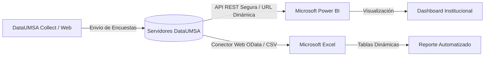

En proyectos de investigación longitudinales o sistemas de monitoreo institucional continuo, descargar archivos manuales a diario resulta ineficiente. **DataUMSA** provee endpoints de sincronización directa que permiten conectar tus datos con herramientas de Business Intelligence (BI) y hojas de cálculo.

---

## ¿Cómo Funciona la Sincronización en Vivo?

A través de la API REST de DataUMSA, herramientas como **Microsoft Power BI** y **Microsoft Excel** pueden consultar periódicamente los datos almacenados en los servidores de la UMSA. Cada vez que una brigada envía un formulario desde su celular, el cuadro de mando se refresca automáticamente con los nuevos indicadores.

---

## Configuración Paso a Paso

### 1. Obtener la URL del Endpoint en DataUMSA
1. Ingresa a tu proyecto en DataUMSA y ve a la pestaña **Datos**.
2. Selecciona la opción **Descargas** en la barra lateral.
3. Elige el formato deseado (se recomienda **CSV** o **XLS** estructurado para Power BI/Excel).
4. Localiza el apartado **Integración por API** o copia el enlace directo provisto por la plataforma para consumos síncronos.

### 2. Conectar en Microsoft Excel
1. Abre Microsoft Excel y crea un nuevo libro de trabajo.
2. Dirígete a la pestaña **Datos** en la cinta superior.
3. Haz clic en **Obtener datos** &gt; **Desde otras fuentes** &gt; **Desde la web**.
4. Pega la URL proporcionada por DataUMSA.
5. En la ventana de autenticación, selecciona **Básica** e introduce tu usuario y contraseña institucional de DataUMSA.
6. Haz clic en **Cargar** o **Transformar datos** en Power Query para iniciar tu análisis.

### 3. Conectar en Microsoft Power BI
1. Abre Power BI Desktop.
2. En la pestaña de inicio, haz clic en **Obtener datos** &gt; **Web**.
3. Pega la URL de tu proyecto.
4. En el diálogo de credenciales, selecciona **Autenticación Básica** y escribe tus credenciales de acceso.
5. Configura tus visualizaciones (gráficos de dispersión, mapas, tablas resumen). A partir de ese momento, solo debes presionar el botón **Actualizar** en Power BI para cargar los últimos datos recopilados en campo.

> [!WARNING]
> **Confidencialidad de Credenciales y URLs:** La URL de exportación síncrona otorga acceso a los registros del proyecto según los permisos de la cuenta autenticada. No compartas URLs públicas con tokens de acceso ni almacenes contraseñas en archivos sin cifrar.
